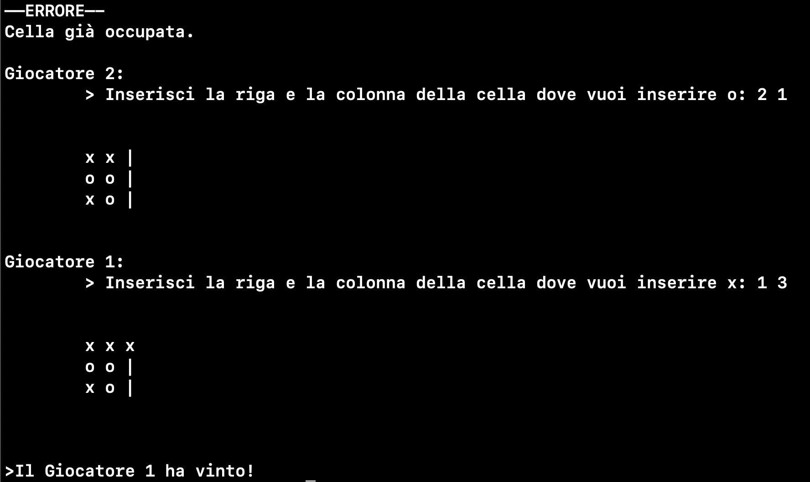

# Tris

#### Semplice gioco tris senza interfaccia grafica rifatto in C.

### Considerazioni
L'indentazione nel codice non è delle migliori, poiché ho ricreato il codice usando un IDE molto particolare: Whatsapp. 
Ho filmato la creazione del progetto e l'ho caricato su Youtube, puoi trovare il video [qui](https://youtu.be/whSLJhX3-RE?si=R45u0XVUB0w6tr75)
### Possibile miglioramento
Aggiungere automaticamente il/la cerchio/croce quando rimane un'unica cella vuota da riempire (la scelta è univoca)
